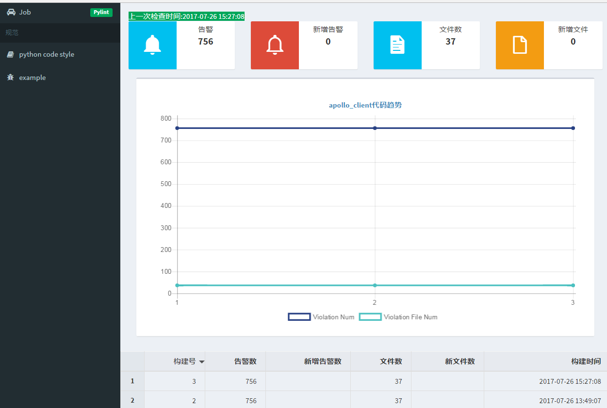

# python-code-check
实现一个基于**jenkins + Pylint**的代码检查工具.  主要有如下特点:

- 在`jenkins`代码检查上包装了一层, 简化了一些繁琐操作(创建credentials、配置job),使的**接入代码检查很简单**.
- 存储jenkins每一次代码检查结果,可以更好地**分析代码质量,推动代码改进**.
- 代码告警通知, **及时发现代码问题**.
  ​

总之,一切是为了改进代码质量.


## 使用简介

#### 首页


会显示当前最新的检查结果. 中间的`天气图标`表示这代码的健康程度,是根据设置的`告警阀值`来显示的.点击**详细**:

点击`代码趋势`这一块会跳转到`jenkins`对每个文件检查的详细信息:

然后就可以根据`pylint`的检查结果进行代码改进.


#### 创建一个待检查的任务


创建一个待检查的任务特别简单, 点击`新建`按钮. 说一下各个字段含义:

| 字段名      | 含义                     |
| -------- | ---------------------- |
| svn      | jenkins上任务源码管理里配置的代码分支 |
| username | svn账号                  |
| password | svn密码                  |
| 任务名      | jenkins job名称          |
| 通知       | 接受代码告警的人列表             |
| 告警阀值     | 当代码告警数超过阀值就会邮件告警       |

创建好后,也可以点击`任务名`进行编辑.

## Jenkins设置


使用`docker`方式启动一个`jenkins`, 或者手动下载.


#### 镜像构建

- `cd jenkins&&docker build -t jenkins:pylint  .`
- `docker run -d --name myjenkins -p 8080:8080 -p 50000:50000 -v /var/jenkins_home:/var/jenkins_home jenkins:pylint`

#### 插件

国内网络慢,可以手动安装将各个插件拷贝到`/var/jenkins_home/plugins`,然后再界面上安装.

- `Credentials Plugin`
- `Violations plugin`
- `Subversion Plug-in`


#### 其他设置:

- `Configure Global Security`-->`CSRF Protection`取消打钩
- `Configure Global Security`--> `访问控制`-->`授权策略`-->`登录用户可以做任何事`--> `Allow anonymouse read access`


**注意:  如果安装的一些`pip`包依赖于操作系统,可以现在jenkins上安装. **

## 接入检查项目设置

检查时需要有代码引用包的环境,所以需要在项目根目录(界面上svn填写地址对应的目录)增加一个`requirements.txt`和`pylint.cfg`文件.

其中`pylint.cfg`里需要修改一下`init-hook=`这句为:

```python
init-hook= 'import sys; sys.path.append("/var/lib/jenkins/workspace/job_name")'
```

`pylint.cfg`使用`pylint --generate-rcfile > pylint.cfg`生成


## 代码部署

 

#### 修改`docker-compose.yml`里`environment`:

- DB_HOST=10.5.2.5
- DB_PORT=33066
- DB_NAME=pylinter
- DB_USER=root
- DB_PASSWORD=!@#$ESZAQ

- DEFAULT_FROM_EMAIL = '528194763@qq.com'
- EMAIL_HOST = 'smtp.qq.com'
- EMAIL_PORT = 587
- EMAIL_HOST_USER = '528194763'
- EMAIL_HOST_PASSWORD = 'vfyaasivgfjgbigc'

- JENKINS_URL=http://10.5.2.5:8080
- JENKINS_USER=admin
- JENKINS_TOKEN=b81bba48120b4441d8af54b485f690b9


#### 修改`front\src\components\views\Dashboard.vue`和 `front\src\components\views\job.vue` 里url指向服务器地址

根据实际去修改对应的变量.


#### 执行命令

```linux
docker-compose build && docker-compose up 
```

#### 创建定时任务

```bash
docker exec -it pythoncodecheck_web_1 python manage.py init_data
```


## 说明

web界面现在未提供删除功能,可以创建一个`django`管理员账号,登陆到`admin`页面就行删除操作.