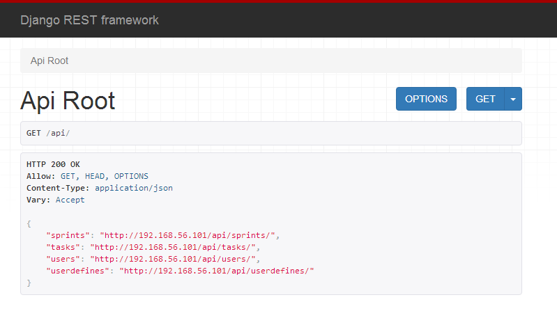

# django-rest-framework 开发模板

为了加速restful接口开发,这里对`django-rest-framework`常用代码进行整理, 在需要开发新的项目时可以迅速开发出后台接口.

## 简介

- 采用`docker`部署, 方便快速搭建好环境(开发和线上)
- 合理的布局,无需修改任何配置即可实现线上和开发环境切换


## 使用

#### 创建项目
```
django-admin startproject --template=https://github.com/510908220/django-backend-template/archive/4.0.tar.gz project_name
```

#### 设置数据库容器
```
docker run --name db -v /var/lib/mysql:/var/lib/mysql -e MYSQL_ROOT_PASSWORD=asheashe -d -p 3306:3306 mysql
```
#### 开发模式
- 创建数据库:`/config/mysql/app.sql`
- 在`docker-compose.yml`目录下执行:`docker-compose up -d`
- 创建用户:`docker-compose run --rm web python manage.py createsuperuser`

#### 线上部署

- 创建数据库:`/config/mysql/app.sql`
- 在`docker-compose.prod.yml`目录下执行:`docker-compose -f docker-compose.prod.yml up -d`
- 创建用户:`docker-compose run --rm web python manage.py createsuperuser`

## 展示

我的`docker`是装在`virtualbox`下的. `192.168.56.101`是虚拟机里系统的ip. 访问`http://192.168.56.101/api/`可以看到如下界面:


这些`api`的例子里包含：
- 分页
- 过滤
- 自定义`viewset`,主要用于对非`model`资源的抽象.
